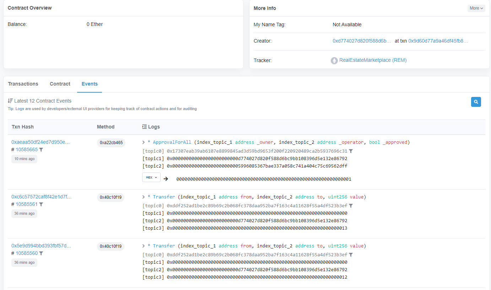

# Udacity Blockchain Capstone

The capstone will build upon the knowledge you have gained in the course in order to build a decentralized housing product.

## Setup
In this section, some key data is provided:

* *Contract address for SolnSquareVerifier on Rinkeby* is [0x8AF51610B1C276d10768ECaDF308B6E01271D615](https://rinkeby.etherscan.io/address/0x8af51610b1c276d10768ecadf308b6e01271d615).
* *ABI/JSON Interface* can be obtained from the *SolnSquareVerifier.json* file at the */eth-contracts/build/contracts/* folder.

* Versions used for a number of tools:
    * [Node](https://nodejs.org/es/) v10.13.9.0
    * [Truffle](https://www.trufflesuite.com/) v5.0.31 (core: 5.0.31)
    * [Solidity](https://solidity.readthedocs.io/en/v0.5.10/) v0.5.2 (solc-js)
    * [web3](https://web3js.readthedocs.io/en/1.0/) v1.2.1
    * [truffle-hdwallet-provider](https://www.npmjs.com/package/truffle-hdwallet-provider) @1.0.5
    * [Ganache CLI](https://github.com/trufflesuite/ganache-cli) v6.12.2
    * [Metamask](https://metamask.io/) Version 10.13.0

## Getting Started
Launch Ganache:

`ganache-cli -m "you should put your seed phrase here"`

In a separate terminal window, compile the smart contracts:

`truffle compile`

## Develop Client

Migrate smart contracts to the locally running blockchain, ganache-cli
`truffle migrate`

To run truffle tests:

`truffle test`

## Deploy on rinkeby network:
`truffle migrate --reset --network rinkeby`

# Minting new tokens
From the root folder, run the command `node mint.js`, this would run and mint tokens for the specified number of creatures whose transaction hashes are consoled on the terminal

## Selling Tokens on OpenSea:

## OpenSea MarketPlace Storefront Link
https://testnets.opensea.io/martialodev
## Tokens Original Owner (Minter):
Address: 0x018C2daBef4904ECbd7118350A0c54DbeaE3549A
Name on OpenSea: "martialodev"

## Tokens Buyer:
Address: [0xd774027d820F588d6bC9BB108396D5E132E86792](https://rinkeby.etherscan.io/address/0x018c2dabef4904ecbd7118350a0c54dbeae3549a)
Name on OpenSea: "martialo"

## Tx Hashes for Selling Operations:

# Project Resources

* [Remix - Solidity IDE](https://remix.ethereum.org/)
* [Visual Studio Code](https://code.visualstudio.com/)
* [Truffle Framework](https://truffleframework.com/)
* [Ganache - One Click Blockchain](https://truffleframework.com/ganache)
* [Open Zeppelin ](https://openzeppelin.org/)
* [Interactive zero knowledge 3-colorability demonstration](http://web.mit.edu/~ezyang/Public/graph/svg.html)
* [Docker](https://docs.docker.com/install/)
* [ZoKrates](https://github.com/Zokrates/ZoKrates)

## Authors

**twitter**: martialo dev [follow me](https://twitter.com/martialobug)

**instagram**: martialo dev [follow me](https://www.instagram.com/martialo_dev/)
